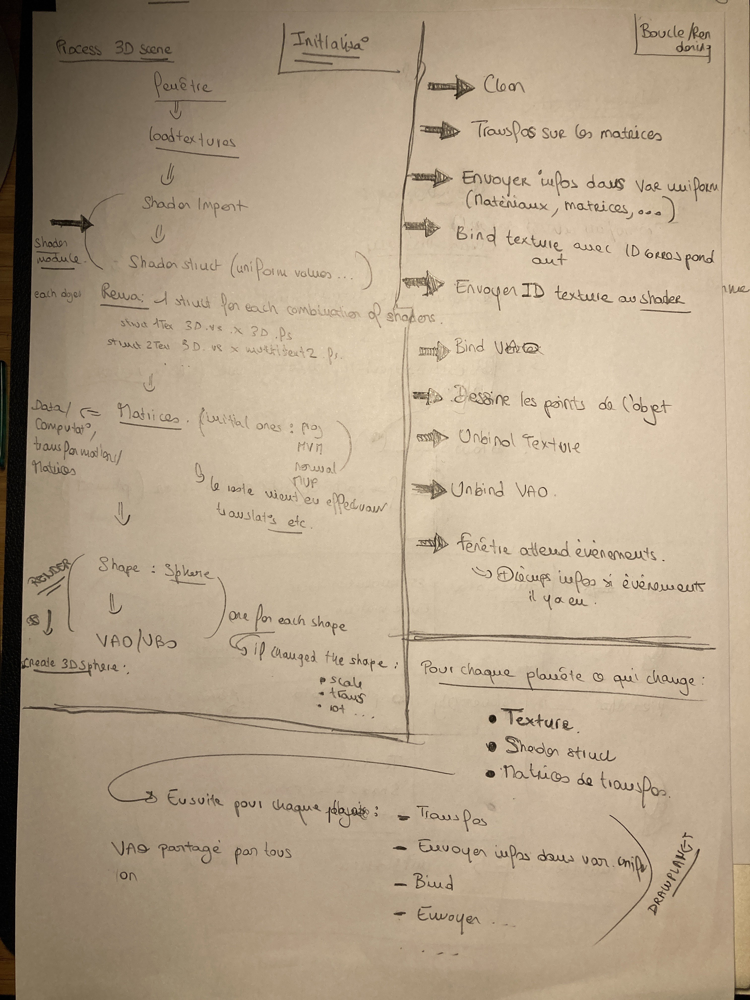
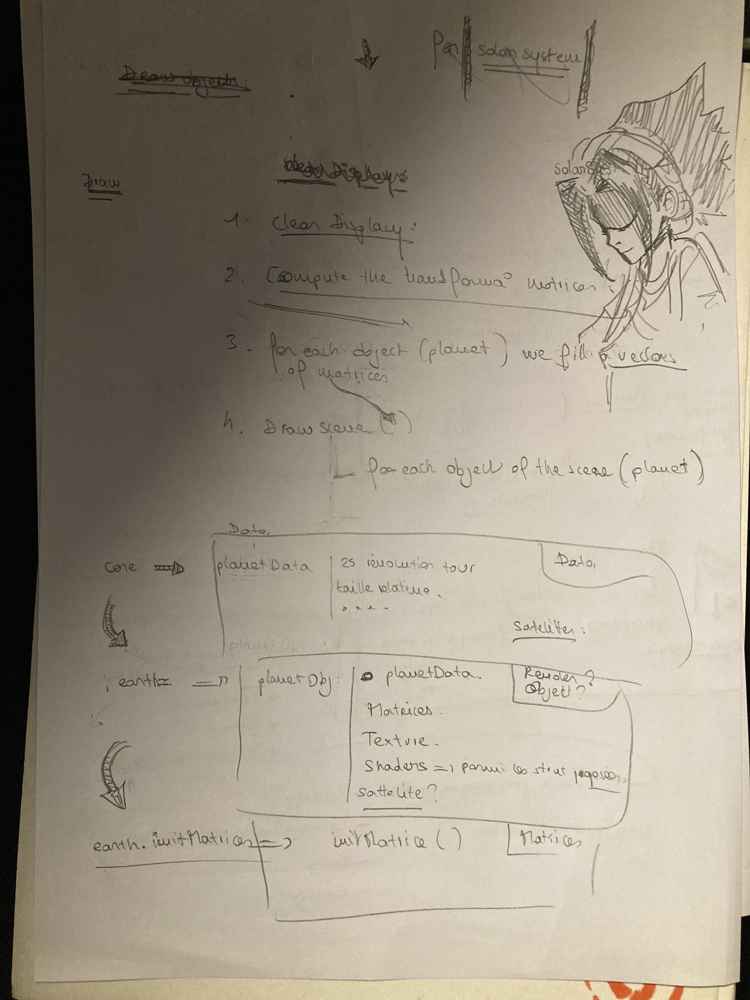
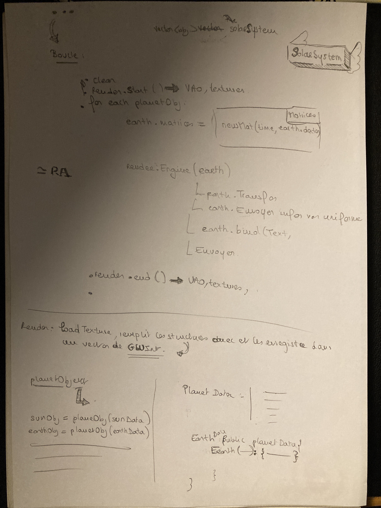

# Notes


## Résumé du sujet

#### Application de visualisation
- Système de callbacks pour nos events dans notre cas.
- Utiliser Valgrind. (Cette page explique tout cequ'il faut savoir : https://stackoverflow.com/questions/5134891/how-do-i-use-valgrind-to-find-memory-leaks)
- Les tailles doivent être relatives seulement (homotétie)
- Séparer la partie "Moteur d'application" et "Moteur de rendu" 


#### Ressources et données

- Rotation du soleil : 25 jours
- Il faut faire apparaître les satellites de chaque planète
- On considère les planètes et satellites commes des sphères parfaites
- Les autres données à récupérer sont données dans le sujet et sont sur les liens fournis


#### Interaction avec utilisateur

- Plusieurs modes de vues
- 1er : Vue au dessus de l'elliptique du soleil
- 2nd : Vue sur le plan de l'elliptique
- 3eme : Vue planétaire
- Sur chaque mode de vue on devra (appui sur touche) :

        - Avancer (rapidement) dans le temps
        - En continu (temps défile jusqu'à ce qu'on appuie de nouveau sur la touche)
        - Sortir de l'application (proprement)


#### Apparence de l'application

- Quel que soit le mode de vue : Affichage texturé des planètes + trajectoires des satellites
- Le fond (l'espace) dpot être représenté par une bounding box affichant un ciel étoilé


## Réflexion personnelle


#### Moteur d'application : 

Partie qui gère le comportement de la scène : cerveau

- Interactions utilisateur
- éclairage
- caméras
- gestion de la fenêtre
- calculs de matrice et autres


#### Moteur de rendu : 

Génère l'image, il convertis les informations en pixels à afficher

- traitement lumières
- textures
- matériaux
- post traitement
- effets visuels


#### Modules

- Moteur application : Contient la boucle principale, gère les données et inclura les modules suivants, 
    
        - Computations : Contient matrices de transfos et tt ce qui est lié aux calculs
        - Camera : Gestion de la caméra avec une classe (comme dans les TPs)
        - Events : Contient les fonctions de callback des touches et clics
        - Textures/Resources : Gère l'import  des textures, ressources etc
        - Data : Contient les données sur les planètes par exemple, chaque planète pourrait faire l'objet d'une classe ou classe héritée
        - Gestion de la fenêtre : Initialisation, Fermeture, OUverture, redimensionnement de la fenêtre
        - Moteur de Rendu
  

- Moteur de rendu : Contient les fonctions de rendu (gldrawArray() dans la boucle principale) et de configuration du contexte graphique (sûrement le GL_DEPTH, glColorBIt etc), il gère les détails concernant la partie graphique
  
        
        - Materials : Gère les coefficients liés aux matériaux dans 
        - Shaders : Gère le link entre les shaders et openGL, compilation, lien et utilisation/gestion des variables uniformes
        - Tampons : VBO/VAO, gestion, allocation, libération
        - Textures : Manipulation des textures, multi texturing etc à travers des classes (comme les TPs), Chargement dans OpenGL (pas récup le fichier sur le disque) des textures, les allouer, les désallouer, gère les caches des textures pour éviter des les charger sans arrêt
 

        //Eventuellement
        - Post traitement
        - Effets spéciaux

main -> application -> rendu


#### Found a good documentation convention


```c

/**
 * @brief This first line is a brief description.
 *
 * The rest of the lines are a more detailed description of the
 * function that outlines what it does and anything interesting about
 * how it does it.
 *
 * @param x Description of the first parameter.
 * @param y Description of the second parameter.
 * @param z Description of the third parameter.
 *
 * @return This is where you describe the possible return values.  
 * If the function is void then there must not be a @return markup
 * element in this doc box! (Don't document something that does not exist.)
 *
 * @note This is how you can add an optional note about the function that
 *    may be of interest to someone using it.
 *
 * @warning This is how you can add an optional warning to a user of the
 *    function suitable for noting things like 'This function is not thread
 *    safe' and so on.
 *
 * @bug This is how you can add an optional description of a known bug in the
 *    function such as: This only works for positive values of z.
 ********************************************************************************/

```

Exemple ici : https://faculty.cs.niu.edu/~winans/howto/doxygen/


### Partie Dylan

~~Penser à mettre la fenêtre dans une classe C++ et ses fonctions pour manipuler l'objet dans le core engine.
Cela permettrait d'être plus maintenable si jamais on devait changer le gestionnaire de fenêtre par exemple
il suffirait juste d'hériter de la classe ou simplement changer le contenu des fonctions.~~


Ajouter le système de retour d'information concernant les évènements. (ceux sur l'état de la fenêtre (GLFW) peuvent être gérés directement dans la fonction callBack)
Le retour d'information serait plutôt à faire les changements liés au mode de vue par exemple etc

Enlever le gladLoad du copnstructeur de Window, pour le mettre dans une fonction du render Engine.


Il serait peut-être mieux dans la conception logicielle d'include le gestionnaire de ressources (pour la partie chargement des textures) dans le module
renderEngine(), renderEngine va prendre en argument le path, il charge depuis le gestionnaire de ressources l'image puis fait les link etc
Cela n'empêchera jamais le coreEngine d'utiloser le module de ressources et cela évitera de diviser lla structure Image dans trop de modules
qui ne sont pas liés, si jamais on doit changer le gestionnaire de ressources par exemple


Se documenter sur une formule de rendu procédurale qui simule des flammes


Penser à gérer le cas de redimensionnement de la fenêtre pour que la scène fit avec le redimensionnement (Probablement changer la matrice de projection en y mettant les nouvelles valeurs de la fenêtre si redimensionnement il y a eu);


Vérifier avec Valgrind, enlever tous les pointeurs C, et vérifier qu'on a la moins de shared pointer possible


### Rapport

Préciser que l'on a essayer au maximum d'éviter les fuites mémoires en évitant les pointeurs C (+ regarder pour les pointeurs pour les tableaux de textures, voir si ils se free automatiquement + regarder pour ma window qui garde une pointeur sur une fenêtre GLFW)









